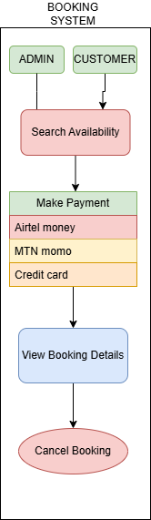

# Requirement-Analysis in Software Development
# Purpose
 the purpose of these repository is all about the requirement analysis in sofware development which focuses on crafting a comprehensive foundation for software development by documenting, analyzing, and structuring requirements. Through a series of well-defined tasks, learners will create a detailed blueprint of the requirement analysis phase for a booking management system. This project simulates a real-world development scenario, emphasizing clarity, precision, and structure in defining requirements to set the stage for successful project execution. 
 # What is Requirement Analysis?
 Requirement Analysis is a critical phase in the software development lifecycle (SDLC) where the project team gathers, analyzes, and defines the requirements of the software product to be developed. This process ensures that all stakeholders have a clear and mutual understanding of what the system should do and how it should perform.
 # Why is Requirement Analysis Important?
 Clarity and Understanding: It helps in understanding what the stakeholders expect from the software, reducing ambiguity.
Scope Definition: Clearly defines the scope of the project, which helps in preventing scope creep.
Basis for Design and Development: Provides a solid foundation for designing and developing the system.
Cost and Time Estimation: Facilitates accurate estimation of project cost, resources, and time.
Quality Assurance: Ensures that the final product meets the specified requirements, leading to higher customer satisfaction.
# Key Activities in Requirement Analysis
1. Requirement Gathering
Engage with stakeholders to collect initial requirements.
Use various techniques like interviews, surveys, and workshops.
2. Requirement Elicitation
Refine and elaborate on the gathered requirements.
Use techniques like brainstorming, focus groups, and prototyping.
3. Requirement Documentation
Document the requirements in a detailed and structured format.
Use requirement specification documents, user stories, and use cases.
4. Requirement Analysis and Modeling
Analyze and prioritize the requirements.
Create models to visualize and understand the requirements.
5. Requirement Validation
Review and validate the requirements with stakeholders.
Define acceptance criteria and ensure traceability.
# Types of Requirements.
# Functional requirements
This decribes what the system should do
Examples: User authentication, property search, booking system, user registration.
# Non functional requirements
This describes how the system shouls perform.
Examples: Performance, security, scalability, usability, reliability.
# Use Case Diagrams
This is the visual representation of interactions between users and the system.
Use case diagrams show how different users (actors) interact with the system to achieve specific goals (use cases).
Benefits of Use Case Diagrams:
>>Provide a clear visual representation of system functionalities.
>>Help in identifying and organizing system requirements.
>>Facilitate communication among stakeholders and development team.
# A use case diagram for the booking system, using Draw.io.

# Acceptance Criteria.
Acceptance criteria are conditions that a feature must meet to be accepted by the stakeholders.
Importance of Acceptance Criteria
Acceptance Criteria define the conditions that must be met for a feature to be accepted by users/stakeholders. They:

Provide clear definition of "done"

Reduce ambiguity in requirements

Guide development and testing

Set stakeholder expectations

Example: Checkout Feature Acceptance Criteria
Given a user has items in their cart
When they proceed to checkout
Then the system should:

Display order summary with total cost

Accept multiple payment methods (card, mobile money)

Generate booking confirmation

Send confirmation email/SMS

Update room availability status

Given invalid payment details
When user submits payment
Then system should display clear error message and prevent booking completion
